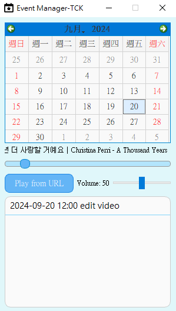
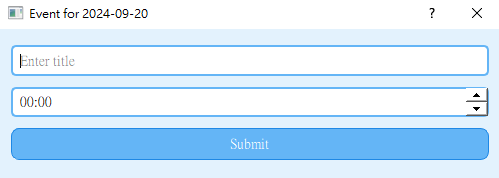
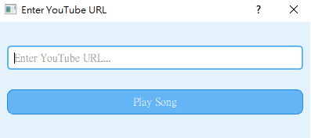
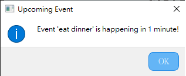

# Alarm_APP

## Motivation
The main reason for creating this app is that we often record things on our calendar but tend to forget them when the time comes.   
To prevent this, we integreted the app with a database to record schedules and send notifications to users `30 minutes`, `5 minutes`, `1 minute` before the scheduled time. Additionally, to make task less monotonous, users can input the `Youtube` links to play the music while working.

## GUI
</img>

## Features
+ Schedule insertion
+ Schdule editing
+ Schedule deletion
+ Automatic deletion of past schedules
+ Youtube music playback
+ Pinned to the top of the screen

## Description
```main.py``` : Display the main screen, excluding the `schedule insertion GUI` and the `Youtube music URL` input GUI.   
```event_dialog.py``` : A python file that creates a `schedule insertion GUI (edit.png)` and a `Youtube music URL` input GUI. (Refer to the image below)

</img> (edit.png)   
</img> (music_gui.png.png)  

```styles.py``` : For decorating each dialog.

---
## Alarm example image
</img> (alarm.png.png)  

If you have any questions or something is unclear, don't hesitate to ask anytime !! thank you
